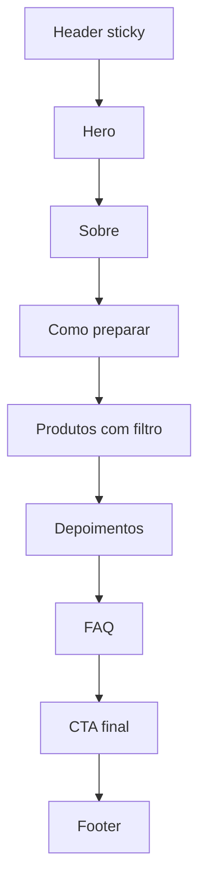

# PLAN.md — Site Auréa Blends

> Plano de implementação para um agente construir o site. Fonte oficial de conteúdo: `perguntas-respostas.md`. Paleta extraída de `assets/aurea-logo.jpg` e `assets/aurea-marketing.jpg`.

## 1. Visão geral

Landing page **única, 100% estática e em PT-BR** para a marca **Auréa Blends** — cápsulas artesanais de chá, café e capuccino, e pirulitos para drinks, produzidas à mão em **Foz do Iguaçu (PR)**.

O site é uma **vitrine**: não existe carrinho, checkout ou preços. Todo botão de compra leva ao **WhatsApp** com mensagem pré-preenchida.

Princípios, em ordem de prioridade:

1. **Rápido** — estático, sem JS de framework, imagens otimizadas, fontes self-hosted.
2. **Fácil de editar** — cores em um único arquivo de tokens; categorias, produtos e textos em arquivos de dados tipados. O site é gerado dinamicamente a partir deles: categoria ou produto novo aparece sozinho, sem tocar em componentes.
3. **Vibe cottagecore calorosa** — paleta creme/caramelo/terracota (extraída do material oficial), tipografia manuscrita, tom acolhedor.

## 2. Escopo

**Incluído:**
- Landing única com seções: Header, Hero, Sobre, Como preparar, Produtos, Depoimentos, FAQ, CTA final, Footer + botão flutuante de WhatsApp.
- CTA de WhatsApp com mensagem pré-preenchida por produto.
- SEO básico (meta tags, OG, favicon, `lang="pt-BR"`), acessibilidade e performance.
- Placeholders elegantes para fotos, depoimentos e validade (ainda não existem).

**Fora de escopo (não implementar):**
- E-commerce, carrinho, pagamentos, preços.
- Blog, CMS, i18n, páginas múltiplas.
- **Qualquer rastreamento** (Google Analytics, Meta Pixel, etc.) — proibido.
- Configuração de domínio/hospedagem.

## 3. Identidade visual

### 3.1 Paleta oficial (extraída das imagens da marca)

| Cor | Hex | Origem |
|---|---|---|
| Creme | `#E4D4C4` | fundo do logo |
| Creme rosé | `#EBD0BB` | material de marketing |
| Rosé areia | `#C9A48C` | material de marketing |
| Bege dourado | `#C3AC8A` | logo |
| Caramelo dourado | `#785018` | traço do logo |
| Caramelo suave | `#82602E` | traço do logo |
| Terracota | `#906348` | material de marketing |

**Regra de ouro:** todos os hexadecimais vivem exclusivamente em `src/styles/tokens.css`. Componentes usam apenas tokens semânticos. Trocar a paleta da marca = editar 1 arquivo.

```css
:root {
  /* ── Paleta oficial (extraída do logo e do marketing) ── */
  --brand-cream:        #E4D4C4;
  --brand-cream-rose:   #EBD0BB;
  --brand-sand:         #C9A48C;
  --brand-gold:         #C3AC8A;
  --brand-caramel:      #785018;
  --brand-caramel-soft: #82602E;
  --brand-terracotta:   #906348;

  /* ── Tokens semânticos (use SÓ estes nos componentes) ── */
  --color-bg:            #F7F0E7;  /* fundo da página (creme claro) */
  --color-surface:       #EFE2D3;  /* cards */
  --color-surface-alt:   #E4D4C4;  /* seções alternadas */
  --color-text:          #3F2E1B;  /* marrom-café escuro (contraste ~10:1) */
  --color-text-muted:    #6E5C46;
  --color-primary:       #785018;  /* CTAs (caramelo do logo) */
  --color-primary-hover: #82602E;
  --color-on-primary:    #FBF6EF;  /* texto sobre caramelo (~6:1) */
  --color-accent:        #906348;  /* selos, bordas decorativas, detalhes */
  --color-border:        #DCC9B4;
}
```

### 3.2 Tipografia

- **Títulos:** *Caveat* (variable) — manuscrita, delicada e legível.
- **Corpo:** *Nunito* (variable) — arredondada e amigável, combina com a vibe artesanal.
- Self-hosted via `@fontsource-variable/caveat` e `@fontsource-variable/nunito` (nenhum request a terceiros).
- Alternativas aceitáveis: *Gochi Hand* (títulos), *Quicksand* (corpo).

### 3.3 Tom de voz

"Seu momento, seu blend." — acolhedor, delicado, artesanal. Sempre em PT-BR. Fala de "blends criados com propósito e delicadeza", "feito à mão", "com carinho".

## 4. Stack

| Camada | Escolha | Por quê |
|---|---|---|
| Framework | **Astro 5** + TypeScript | Estático por padrão (zero JS), rápido, componentes simples, ideal para vitrine |
| Estilo | **CSS vanilla** com custom properties | Tokens de cor num arquivo só; sem camada de configuração para manter |
| Fontes | `@fontsource-variable/*` | Self-hosted, rápido, sem rastreamento via CDN |
| UI/JS | Nenhum framework; JS inline mínimo (filtro de categorias) | Performance |

Não usar Tailwind nem UI kits — para uma landing única com tokens próprios, CSS vanilla é mais simples de manter.

## 5. Arquitetura do projeto

```
aurea-blends/
├── AGENTS.md
├── PLAN.md
├── perguntas-respostas.md      # fonte de conteúdo
├── astro.config.mjs
├── package.json
├── assets/                     # material bruto da marca (logo, marketing)
├── public/
│   └── favicon.svg             # monograma "A" em caramelo sobre creme
└── src/
    ├── components/
    │   ├── Header.astro            # sticky, logo + âncoras + CTA WhatsApp
    │   ├── Hero.astro
    │   ├── About.astro             # história + Foz do Iguaçu
    │   ├── HowItWorks.astro        # 3 passos (essencial — ver §7.4)
    │   ├── Products.astro          # filtro por categoria + grid de cards
    │   ├── ProductCard.astro
    │   ├── Testimonials.astro
    │   ├── FAQ.astro
    │   ├── FinalCTA.astro
    │   ├── Footer.astro
    │   ├── WhatsAppFloat.astro      # botão flutuante
    │   ├── ImagePlaceholder.astro  # placeholder SVG/emoji por produto
    │   └── Badge.astro             # "Zero açúcar", "100% natural"...
    ├── data/
    │   ├── site.ts                 # marca, slogan, história, contatos
    │   ├── categories.ts           # tipos/categorias de produto (fácil de editar)
    │   ├── products.ts             # lista de produtos (fácil de editar)
    │   └── testimonials.ts
    ├── lib/
    │   └── whatsapp.ts             # buildWhatsAppLink(message)
    ├── layouts/
    │   └── Base.astro              # <head>, SEO, fontes, tokens/global css
    ├── pages/
    │   └── index.astro
    └── styles/
        ├── tokens.css              # ÚNICO arquivo com cores
        └── global.css              # reset, base, tipografia, utilitários
```

## 6. Conteúdo dinâmico (fácil de editar)

### 6.1 `src/data/site.ts`

```ts
export const site = {
  name: 'Auréa Blends',
  slogan: 'Seu momento, seu blend.',
  tagline: 'Blends personalizados, criados com propósito e delicadeza.',
  city: 'Foz do Iguaçu — PR',
  whatsapp: '5545999672040',        // formato wa.me, sem símbolos
  whatsappDisplay: '(45) 99967-2404',
  instagram: 'aureablends',
  badges: ['Zero açúcar', '100% natural', 'Feito à mão', 'Produção própria'],
  delivery: 'Entregamos em todo o território brasileiro. Taxas consultadas no WhatsApp.',
};
```

### 6.2 `src/data/categories.ts` — tipos de produto

Os **tipos de produto são dados, não código**. Hoje existem chás, cafés (e derivados) e pirulitos — amanhã podem surgir kits de presente, acessórios, um novo tipo de café. Nada disso deve exigir mudança em componentes.

```ts
export interface Category {
  id: string;           // slug único, ex.: 'chas'
  label: string;        // ex.: 'Chás'
  emoji?: string;       // ex.: '🍵' — usado no filtro e nos placeholders
  description?: string; // opcional, ex.: 'Cápsulas que derretem na caneca'
}

export const categories: Category[] = [
  { id: 'chas',      label: 'Chás',                  emoji: '🍵' },
  { id: 'cafe',      label: 'Cafés',                 emoji: '☕' },
  { id: 'capuccino', label: 'Capuccinos',            emoji: '🥛' },
  { id: 'pirulitos', label: 'Pirulitos para drinks', emoji: '🍭' },
];
```

### 6.3 `src/data/products.ts`

```ts
export interface Product {
  id: string;            // slug único, ex.: 'cha-branco-mirtilo'
  name: string;
  categoryId: string;    // deve existir em categories.ts
  ingredients: string[];
  description: string;   // 1–2 frases convidativas
  kit: string;           // ex.: 'Caixinha com 6 cápsulas'
  weight?: string;       // '~35 g por cápsula' (confirmar com a dona)
  validity?: string;     // placeholder: 'Consultar no rótulo'
  image?: string;        // ausente → usa ImagePlaceholder
  emoji?: string;        // arte do placeholder, ex.: '🫐'
  featured?: boolean;    // aparece em destaque no topo da seção
}

export const DEFAULT_KIT = 'Caixinha com 6 cápsulas';
```

**Validação em build:** um helper (em `src/lib/` ou no próprio `Products.astro`) verifica que todo `categoryId` existe em `categories.ts`. Referência desconhecida **quebra o build** com erro claro — nunca vira card quebrado em produção.

**Lista completa a cadastrar** (nomes normalizados a partir do `perguntas-respostas.md`):

**Chás (12):**
1. Chá branco com goji berry, mirtilo e calêndula — 🫐
2. Chá branco com hibisco, camomila e rosa branca — 🌸
3. Chá branco com maçã verde, limão siciliano e hortelã — 🍏
4. Chá preto com pêssego e baunilha — 🍑
5. Chá preto com limão siciliano, hortelã e cardamomo — 🍋
6. Chá preto com hibisco, mirtilo e frutas vermelhas — 🍓
7. Chá verde com laranja e capim-limão — 🍊
8. Chá verde com hibisco e morango — 🍓
9. Matcha com coco e baunilha — 🍵
10. Fada azul com mirtilo e baunilha — 💙
11. Tangerina, laranja, rosa branca e cardamomo — 🍊
12. Anis estrelado com gengibre e morango — 🫚

**Café:**
- Café puro — ☕ (categoria própria)

**Capuccino (variações: café, leite e chocolate — confirmar com a dona):**
- Capuccino — ☕

**Pirulitos para drinks (3):**
1. Frutas vermelhas com pinta rosa e gengibre — 🍓
2. Tangerina com cardamomo, maçã e laranja — 🍊
3. Limão siciliano com hortelã e anis estrelado — 🍋

Todos com `kit: DEFAULT_KIT` (todos os produtos são vendidos em kits, ex.: caixinha com 6 cápsulas). Todos exibem o badge "Zero açúcar".

### 6.4 `src/data/testimonials.ts`

3 depoimentos **placeholder** com campo `placeholder: true` (ex.: "Momento de autocuidado perfeito 🧡" — Maria, Foz do Iguaçu). Quando os depoimentos reais chegarem, basta trocar o texto/nome e remover a flag.

## 7. Especificação da página



### 7.1 Header
Sticky e translúcido (creme com leve blur). Logo (usar `assets/aurea-logo.jpg` dentro de um container creme arredondado — o JPG tem fundo creme, então deve "fundir" com o container). Nav com âncoras suaves: Sobre · Como preparar · Blends · Depoimentos · FAQ. CTA "Pedir no WhatsApp".

### 7.2 Hero
- Título manuscrito grande: "Seu momento, seu blend."
- Subtítulo: "Blends artesanais de chá, café e capuccino, e pirulitos para drinks — criados com propósito e delicadeza em Foz do Iguaçu."
- Dois CTAs: **"Ver blends"** (âncora para produtos) e **"Falar no WhatsApp"** (link geral pré-preenchido).
- Badges: Zero açúcar · 100% natural · Feito à mão.
- Arte lateral: composição de placeholder (caneca + cápsulas + emojis) em tons da paleta.

### 7.3 Sobre
História da marca (do `perguntas-respostas.md` #3): paixão pela arte, cultivo do próprio chá, conexão com o meio ambiente, sustentabilidade e sabor; cápsulas como "pequenas joias", fruto de estudos e cursos. Mencionar "feito à mão em Foz do Iguaçu 💛".

### 7.4 Como preparar — seção ESSENCIAL
As cápsulas da Auréa **não são de máquina** (não são compatíveis com Nespresso/Dolce Gusto). O preparo é:

1. **Escolha seu blend** — cada kit vem em caixinha com 6 cápsulas.
2. **Coloque na caneca** — 1 cápsula + 200 ml de água quente (chás) ou leite quente (café/capuccino).
3. **Mexa e aproveite** — seu momento, seu blend.

Deixar isso explícito evita a confusão mais comum ("serve na minha máquina?"). Para os pirulitos: "encaixe no copo, sirva a bebida e mexa".

### 7.5 Produtos
- Filtro por categoria **gerado dinamicamente** de `categories.ts`: botão "Todos" + um botão por categoria que tenha produtos (categoria sem produto some sozinha do filtro). Preferir solução CSS-only (radio + `:checked`); se usar JS, inline e mínimo.
- Grid responsivo de cards (1 coluna mobile / 2 tablet / 3 desktop).
- **Card:** placeholder de imagem (emoji sobre gradiente creme) ou foto real quando existir; nome; ingredientes como chips; kit ("Caixinha com 6 cápsulas"); badge "Zero açúcar"; botão **"Pedir pelo WhatsApp"** com mensagem pré-preenchida do produto.
- Sem preços — o CTA é sempre "Consultar no WhatsApp".

### 7.6 Depoimentos
3 cards com placeholder (aspas grandes, texto, nome, cidade). Marcar visualmente como espaço para conteúdo real? Não — os placeholders devem parecer intencionais e bonitos, apenas trocáveis via `testimonials.ts`.

### 7.7 FAQ (accordion nativo `<details>`)
- "Como faço meu pedido?" → Tudo pelo WhatsApp: escolha seus blends e chame a gente.
- "Preciso de máquina de café?" → Não! É só colocar a cápsula na caneca, adicionar 200 ml de água ou leite quente e mexer.
- "Vocês entregam?" → Em todo o Brasil; taxas consultadas no WhatsApp.
- "Qual a validade?" → Cada blend tem sua validade — consulte no rótulo ou pergunte no WhatsApp.
- "Tem açúcar?" → Zero açúcar, ingredientes 100% naturais.

### 7.8 CTA final + Footer
- Faixa caramelo com texto manuscrito claro: "Que tal criar seu momento?" + botão WhatsApp.
- Footer: logo, @aureablends (link), WhatsApp, "Feito com carinho em Foz do Iguaçu 💛", ano.

### 7.9 Botão flutuante de WhatsApp
Fixo no canto inferior direito (mobile e desktop), com `aria-label`, ícone SVG inline do WhatsApp em caramelo sobre círculo creme.

## 8. Fluxo do WhatsApp

- Número: **+55 45 99967-2404** → `https://wa.me/5545999672040`
- Helper em `src/lib/whatsapp.ts`:

```ts
export function buildWhatsAppLink(message: string): string {
  return `https://wa.me/${site.whatsapp}?text=${encodeURIComponent(message)}`;
}

export function productMessage(product: Product): string {
  return `Oi, Auréa! 💛 Vi seu site e me encantei pelo kit de ${product.name}. Pode me contar mais?`;
}

export const GENERAL_MESSAGE = 'Oi, Auréa! 💛 Vim pelo site e quero saber mais sobre os blends.';
```

- Todos os CTAs abrem em `target="_blank"` com `rel="noopener noreferrer"`.

## 9. SEO, acessibilidade e performance

**SEO:** `<html lang="pt-BR">`; title "Auréa Blends — Blends artesanais de chá, café e capuccino"; meta description com o slogan + WhatsApp; Open Graph (usar placeholder de `og-image` até existir foto oficial); favicon SVG; JSON-LD `Organization` (nome, slogan, Instagram, cidade — sem endereço físico).

**Acessibilidade:** contraste AA nos tokens (valores do §3.1 já verificados ~10:1 e ~6:1); foco visível; `alt` descritivo em todas as imagens; `prefers-reduced-motion` respeitado; accordion com `<details>/<summary>`; âncoras com `scroll-margin-top`.

**Performance:** zero JS de framework; fontes self-hosted com `font-display: swap`; imagens via `<Image>` do Astro (quando existirem fotos reais); Lighthouse mobile ≥ 95 nas quatro categorias; nenhum request a terceiros.

## 10. Placeholders

- **Fotos:** componente `ImagePlaceholder.astro` — SVG com gradiente creme/rosé, emoji do produto grande e nome do blend em Caveat. Deve parecer intencional, não "quebrado".
- **Depoimentos:** 3 exemplos realistas com `placeholder: true`.
- **Validade:** campo por produto com "Consultar no rótulo".
- **Quando conteúdo real chegar:** fotos em `src/assets/products/` + preencher `image` no `products.ts`; depoimentos reais em `testimonials.ts`. Nada mais muda.

## 11. Facilidade de edições futuras (requisito explícito)

| Quero mudar | Onde | Esforço |
|---|---|---|
| Cores da marca | `src/styles/tokens.css` | 1 arquivo |
| Adicionar/remover produto | `src/data/products.ts` | 1 objeto |
| Nova categoria/tipo de produto | `src/data/categories.ts` + produtos em `products.ts` | 1 objeto + N produtos |
| Textos, contatos, redes | `src/data/site.ts` | 1 arquivo |
| Depoimentos | `src/data/testimonials.ts` | 1 arquivo |
| Trocar placeholder por foto real | `image` no produto | 1 campo |

O TypeScript garante que edições nos dados quebrem o build (e não o site) se algo estiver faltando.

## 12. Critérios de aceite

- [ ] `npm run build` passa sem erros nem warnings.
- [ ] Lighthouse mobile ≥ 95 em Performance, Acessibilidade, Boas práticas e SEO.
- [ ] Nenhum hex fora de `tokens.css`; nenhum request a terceiros no build.
- [ ] Todos os CTAs de produto abrem o WhatsApp com a mensagem correta pré-preenchida.
- [ ] Filtro de categorias funciona (CSS-only ou JS mínimo) e é gerado a partir de `categories.ts`.
- [ ] Prova dinâmica: adicionar uma categoria nova + 1 produto apenas em `data/` atualiza filtro e grid sem tocar em nenhum componente.
- [ ] Conteúdo 100% PT-BR, tom acolhedor, sem preços em lugar nenhum.
- [ ] Seção "Como preparar" deixa claro que não precisa de máquina.
- [ ] Placeholders de imagem/depoimentos aparecem bonitos e intencionais.
- [ ] Navegação por âncoras suave; foco visível; contraste AA.

## 13. Observações e riscos

- **Logo é JPG com fundo creme** — usar dentro de container creme arredondado para o fundo "sumir". Pedir à dona uma versão PNG transparente no futuro.
- **"Cápsula" gera expectativa de máquina** — a seção "Como preparar" e o FAQ atacam essa confusão de frente.
- **Peso de 35 g** — assumir "~35 g por cápsula" e confirmar com a dona (pode ser por kit).
- **Capuccino** — variações "café, leite e chocolate" interpretadas do Q&A; confirmar com a dona e ajustar `products.ts` se necessário.
- **Catálogo vai crescer** — a lista de tipos não está fechada (podem surgir novos cafés, kits, acessórios). Por isso categorias e produtos são 100% data-driven: nunca hardcodar ids de categoria em componentes.
- **Sem rastreamento** — nenhuma ferramenta de analytics, pixels ou fontes de CDN.
